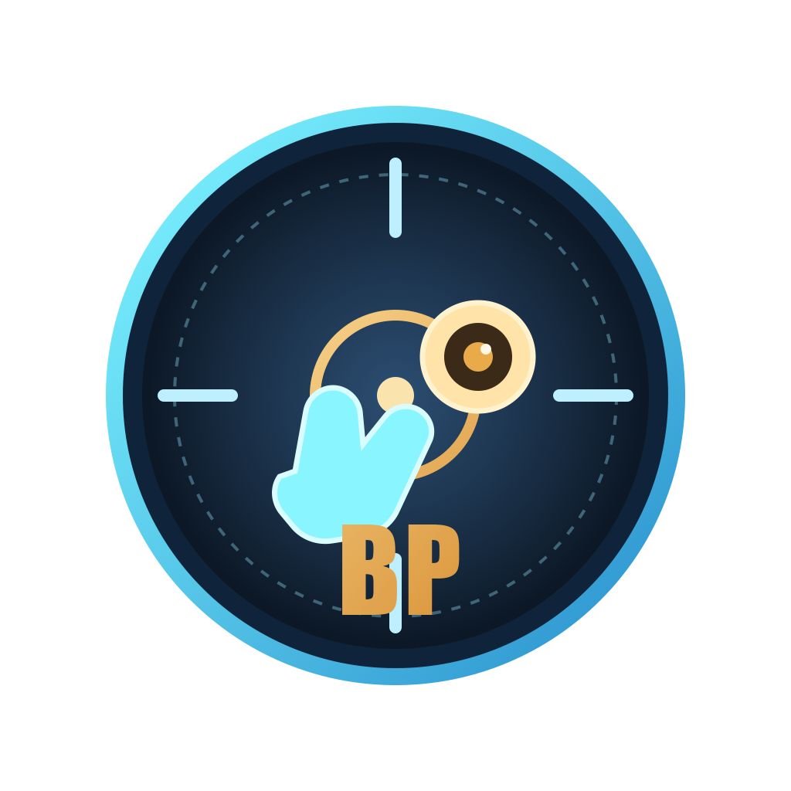

# bubble poppAR

2-player webcam shooter with hand/eye gesture controls, real-time multiplayer, and server-authoritative scoring.



- Demo: [https://ramapohack2026.onrender.com](https://ramapohack2026.onrender.com)
- Stack: Next.js + React + TypeScript + Express + Socket.IO + Three.js + MediaPipe

## Screenshots


| Gameplay 1 | Gameplay 2 |
| --- | --- |
|  |  |

## Core Features

- 2-player real-time room system with **4-letter room codes**
- Server-authoritative match state and hit scoring
- Input modes:
  - Hand tracking (pinch to shoot)
  - Eye tracking (blink to shoot)
  - Mouse fallback
- Live opponent camera feed (WebRTC)
- Match countdown, scoreboard, winner/tie resolution
- Optional server-side ElevenLabs voice callouts

## Tech Stack

- Frontend: `Next.js 15`, `React 19`, `TypeScript`
- Rendering: `Three.js`
- Vision: `@mediapipe/tasks-vision`
- Backend: `Express` + `Socket.IO`
- Security middleware: `helmet`, `cors`
- Runtime: `Node.js 20+`
- Deployment: Docker + Render Blueprint

## Quick Start

### 1. Requirements

- Node.js `20+`
- npm `10+`

### 2. Install

```bash
npm install
npm run setup:mediapipe
```

### 3. Run (dev)

```bash
npm run dev
```

Open [http://localhost:3000](http://localhost:3000).

### 4. Build + production run

```bash
npm run build
npm run start
```

## Environment Variables

| Variable | Required | Description |
| --- | --- | --- |
| `PORT` | No | Server port (default `3000`) |
| `HOST` | No | Bind host (default `0.0.0.0`) |
| `CORS_ORIGINS` | No | Comma-separated browser origin allowlist |
| `NEXT_PUBLIC_SERVER_URL` | No | Explicit socket server URL for client |
| `ELEVENLABS_API_KEY` | No | Enables server-side TTS voice lines |
| `ELEVENLABS_VOICE_ID` | No | Voice ID for ElevenLabs |
| `ELEVENLABS_MODEL_ID` | No | Model ID (default `eleven_multilingual_v2`) |

## Controls

- **Hand mode**: move hand to aim, pinch to shoot
- **Eye mode**: move face to aim, blink both eyes to shoot
- **Mouse mode**: move cursor to aim, click to shoot

## Multiplayer Flow

1. Player 1 creates a room.
2. Player 2 joins with the room code.
3. Host chooses input mode + duration and starts match.
4. Server runs authoritative state updates and scoring.
5. Winner is decided by score at timeout (or by forfeit if a player leaves).

## Project Structure

```text
app/                      # Next.js app shell
src/client/               # Browser runtime (UI, vision, game engine, socket client)
src/server/game/          # Game server logic (rooms, validation, match loop, socket handlers)
public/                   # Static assets (audio, MediaPipe files)
server.ts                 # Next + Express + Socket.IO server entrypoint
render.yaml               # Render Blueprint config
Dockerfile                # Container build
```

## Deployment

### Render

This repo includes `render.yaml` for one-click Blueprint deployment.

### Docker

```bash
docker build -t bubble-poppar .
docker run --rm -p 3000:3000 -e HOST=0.0.0.0 bubble-poppar
```

## MVP Notes

This project is optimized for hackathon delivery:

- In-memory room storage (no DB)
- 2-player rooms only
- Fast fallback path to mouse mode when camera/vision fails

For scaling beyond MVP, see improvement ideas in the section below.

## Improvement Ideas (Post-Hackathon)

- Add persistent profiles, matchmaking, and room history (database-backed)
- Add reconnect + session resume instead of forcing room rejoin on disconnect
- Add anti-cheat telemetry and replay validation for shot events
- Add spectator mode and tournament brackets
- Add CI: lint, typecheck, unit/integration test jobs
- Add runtime observability (structured logs, traces, metrics)
