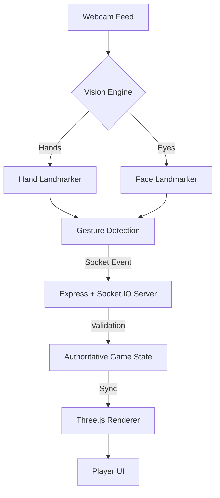

<div align="center">
  

  # 🫧 bubble poppAR
  ### The Future of Hands-Free Competitive Popping

  **2-player webcam shooter with hand/eye gesture controls, real-time multiplayer, and server-authoritative scoring.**

  [](https://nextjs.org/)
  [](https://www.typescriptlang.org/)
  [](https://socket.io/)
  [](https://threejs.org/)
  [](https://mediapipe.dev/)

  <br />

  [](https://ramapohack2026.onrender.com)
  [](https://www.instagram.com/reel/DSaUZYuD4QY/?igsh=MXJ5dXlwNDlwbmF5Mg==)
  
  <br />
</div>

---

## 🌟 Overview

**bubble poppAR** is a boundary-pushing web experience that turns your body into the controller. Built for **RamapoHack 2026**, it combines cutting-edge Computer Vision with low-latency networking to create a competitive "bubble-popping" arena.

---

## ✨ Features

- 🎮 **Instant Matchmaking**: Create a room, share a 4-letter code, and start popping in seconds.
- 🤏 **Pinch-to-Pop**: Powered by Google's MediaPipe, use high-precision hand tracking to aim and shoot.
- 👁️ **Eye-to-Eye**: Hands full? Switch to eye-tracking mode and blink to clear the board.
- ⚡ **Zero-Cheat Architecture**: A server-authoritative match loop ensures every shot is validated.
- 🔊 **Sonic Atmosphere**: AI-generated voice lines from ElevenLabs celebrate your victories.
- 📹 **Live Feedback**: Real-time WebRTC camera feeds let you see your opponent's frustration!

---

## 📸 Guided Tour

### 🎯 Mission Setup
The command center where you prepare for battle.


<div align="center">
  <table>
    <tr>
      <td width="50%" align="center"><b>🤝 Waiting Room</b></td>
      <td width="50%" align="center"><b>🚀 Gameplay</b></td>
    </tr>
    <tr>
      <td></td>
      <td></td>
    </tr>
  </table>
</div>

---

## ⚙️ How It Works


```mermaid
graph TD
    A[Webcam Feed] --> B{Vision Engine}
    B -->|Hands| C[Hand Landmarker]
    B -->|Eyes| D[Face Landmarker]
    C --> E[Gesture Detection]
    D --> E
    E -->|Socket Event| F[Express + Socket.IO Server]
    F -->|Validation| G[Authoritative Game State]
    G -->|Sync| H[Three.js Renderer]
    H --> I[Player UI]
```

---

## 🛠️ Tech Stack

<details>
<summary><b>Click to expand our technical details</b></summary>
<br />

- **Frontend Core**: `Next.js 15` (App Router) • `React 19` • `TypeScript`
- **Visualization**: `Three.js` (WebGL Engine) for rendering the 3D bubble arena.
- **AI/Vision**: `@mediapipe/tasks-vision` running in a WebWorker for smooth 60fps tracking.
- **Real-time**: `Socket.IO` for binary-packed game state synchronization.
- **Media**: `WebRTC` for peer-to-peer video streaming.
- **Backend**: `Express.js` on Node.js 20.
- **Voice**: `ElevenLabs API` for server-side Text-to-Speech generation.

</details>

---

## 🚀 Quick Start

### 1. Requirements
- Node.js `20+`
- npm `10+`

### 2. Setup
```bash
# Clone and install
git clone https://github.com/daniel-rajakumar/RamapoHack2026.git
cd RamapoHack2026
npm install

# Download AI Models
npm run setup:mediapipe
```

### 3. Launch
```bash
npm run dev
```
Open [http://localhost:3000](http://localhost:3000) and get ready!

---

## 🎮 Mastering the Game

| Interaction | Mode | Action |
| :--- | :--- | :--- |
| 🖐️ **Aim** | Hand | Hover your palm in front of the camera |
| 💥 **Shoot** | Hand | **Pinch** index finger and thumb together |
| 🎯 **Sight** | Eye | Center your face; the cursor follows your gaze |
| ⚡ **Fire** | Eye | **Blink** both eyes simultaneously |

---

## 🏗️ Future Roadmap

- [ ] **Global Leaderboards**: See how you rank against the best poppers in the world.
- [ ] **Reconnect Magic**: Smart session resume so a glitchy Wi-Fi won't end your streak.
- [ ] **Anti-Cheat V2**: Server-side replay verification for professional competitive integrity.
- [ ] **Spectator Mode**: Host rooms with dedicated observers and commentators.

---

<div align="center">

  **Built with ❤️ for RamapoHack 2026**
  
  [Website](https://ramapohack2026.onrender.com) • [Report Bug](https://github.com/daniel-rajakumar/RamapoHack2026/issues) • [Support](mailto:support@bubblepoppar.com)
</div>
