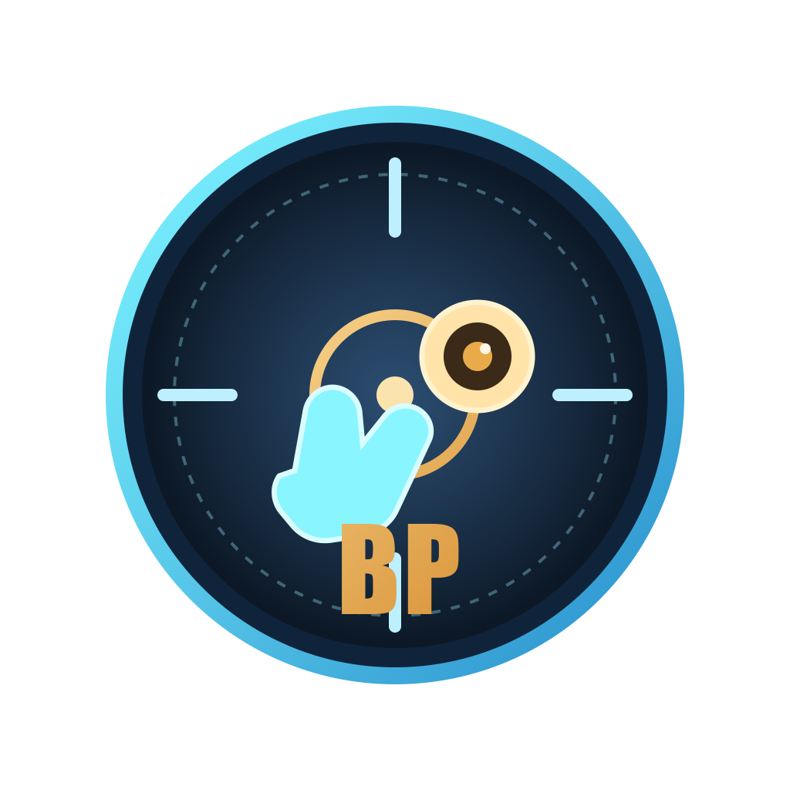
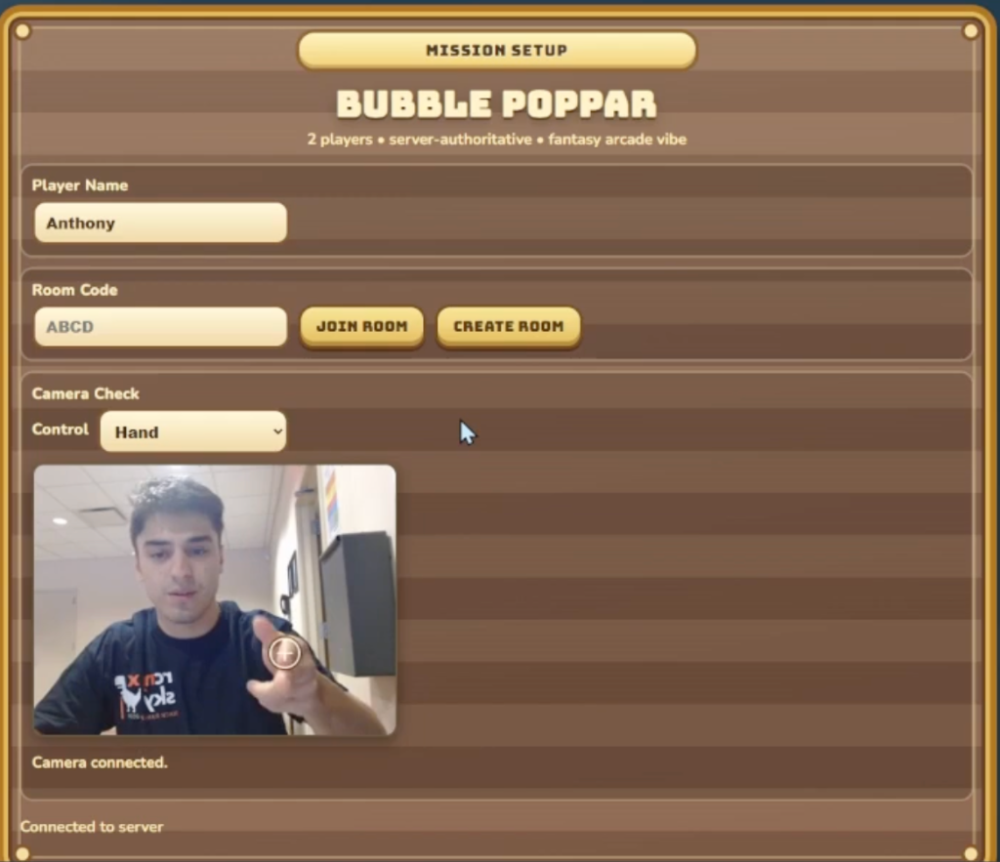
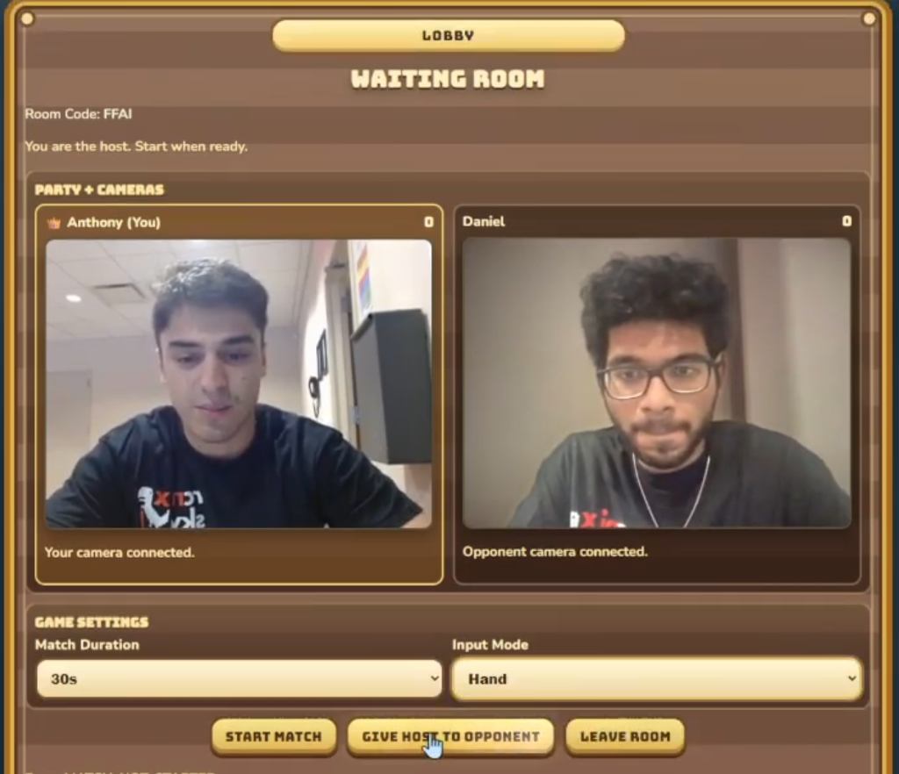
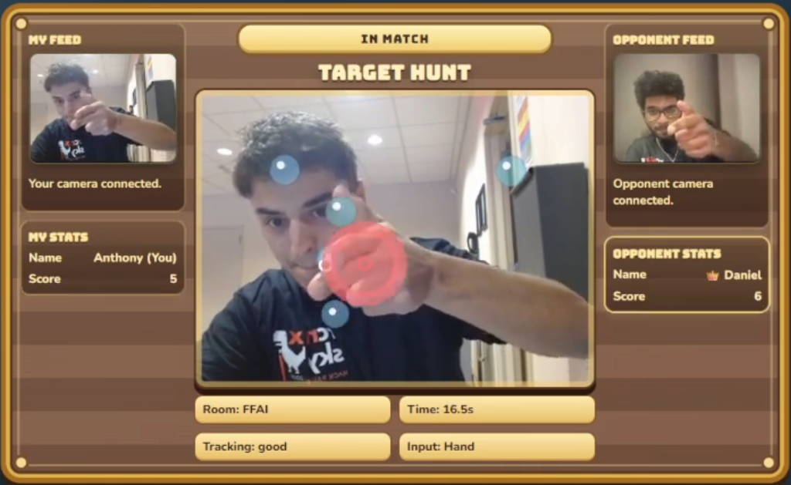

<div align="center">
  

  # 🫧 bubble poppAR

  **2-player webcam shooter with hand/eye gesture controls, real-time multiplayer, and server-authoritative scoring.**

  [](https://nextjs.org/)
  [](https://www.typescriptlang.org/)
  [](https://socket.io/)
  [](https://threejs.org/)
  [](https://mediapipe.dev/)

  [🚀 Live Demo](https://ramapohack2026.onrender.com) • [🎥 Inspiration](https://www.instagram.com/reel/DSaUZYuD4QY/?igsh=MXJ5dXlwNDlwbmF5Mg==)
</div>

---

## ✨ Features

- 🎮 **Real-time Multiplayer**: 2-player room system with high-speed synchronization.
- 🤏 **Hand Tracking**: Pinch your fingers to blast away your opponent!
- 👁️ **Eye Tracking**: Blink both eyes for a hands-free shooting experience.
- ⚡ **Authoritative Scoring**: No cheating! The server handles all hit detection and game state.
- 🔊 **Voice Callouts**: Dynamic AI-powered voice lines using ElevenLabs.
- 📹 **WebRTC Feed**: See your opponent's camera feed in real-time as you play.

## 📸 Guided Tour

### 🎯 Mission Setup
The command center where you prepare for battle.


<div align="center">
  <table>
    <tr>
      <td width="50%"><b>🤝 Waiting Room</b></td>
      <td width="50%"><b>🚀 Gameplay</b></td>
    </tr>
    <tr>
      <td></td>
      <td></td>
    </tr>
  </table>
</div>

---

## 🛠️ Tech Stack

- **Frontend**: `Next.js 15` • `React 19` • `TypeScript`
- **Graphics**: `Three.js` (WebGL Rendering)
- **Computer Vision**: `@mediapipe/tasks-vision`
- **Networking**: `Socket.IO` (Real-time) • `WebRTC` (Camera Feed)
- **Backend**: `Express` (Node.js) • `ElevenLabs` (Voice AI)
- **Infrastructure**: Docker • Render Blueprint

---

## 🚀 Quick Start

### 1. Requirements
- Node.js `20+`
- npm `10+`

### 2. Setup & Installation
```bash
# Clone the repository
git clone https://github.com/daniel-rajakumar/RamapoHack2026.git
cd RamapoHack2026

# Install dependencies
npm install

# Prepare MediaPipe models
npm run setup:mediapipe
```

### 3. Run Locally
```bash
# Start development server
npm run dev
```
Open [http://localhost:3000](http://localhost:3000) to start popping!

---

## 🎮 Controls

| Mode | Action | Gesture |
| :--- | :--- | :--- |
| 🖐️ **Hand** | Aim & Shoot | Move hand to aim, **pinch** (index + thumb) to shoot |
| 👁️ **Eye** | Aim & Shoot | Move face to aim, **blink both eyes** to shoot |
| 🖱️ **Mouse** | Aim & Shoot | Move mouse to aim, **click** to shoot |

---

## 📂 Project Structure

```text
app/                      # Next.js app shell
src/client/               # Browser runtime (UI, vision, game engine, socket client)
src/server/game/          # Game server logic (rooms, validation, match loop)
public/                   # Static assets (audio, MediaPipe files, screenshots)
server.ts                 # Next + Express + Socket.IO server entrypoint
render.yaml               # Deployment config
```

---

## 🏗️ Future Roadmap

- [ ] **Persistent Profiles**: Global leaderboards and matchmaking history.
- [ ] **Reconnect Logic**: Resume matches automatically after a disconnect.
- [ ] **Anti-Cheat**: Server-side replay validation for perfect competitive integrity.
- [ ] **Spectator Mode**: Allow others to watch the battle in real-time.
- [ ] **Tournament Brackets**: Integrated bracket support for hackathon events.

---

<div align="center">
  Made with ❤️ for RamapoHack 2026
</div>
